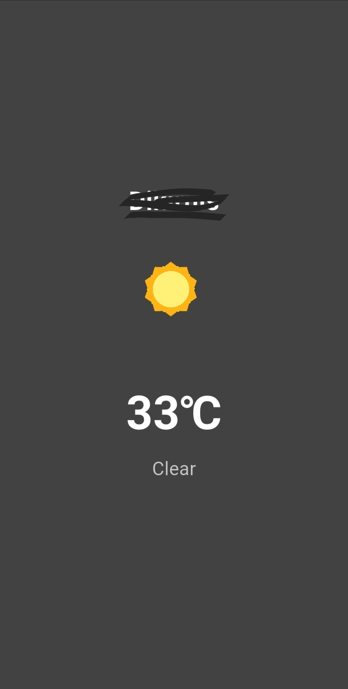

🌤️ Weather App

A Flutter weather application that automatically detects the user's current location and retrieves real-time weather data.

---

📱 Features

- 📍 Automatic location detection.
- 🌡️ Real-time temperature display.
- ☁️ Current weather information based on the user's location.
- 🎨 Clean and responsive user interface.
- ⚠️ Error handling for location and network issues.

---
 🛠️ Technologies Used

- Flutter
- Dart
- Weather API
- Location Services
- HTTP Requests

---

📝 Note

The application currently focuses on providing accurate temperature and location-based weather data. Some weather condition icons and visual representations are still under development and may not yet cover all possible weather states.

---

